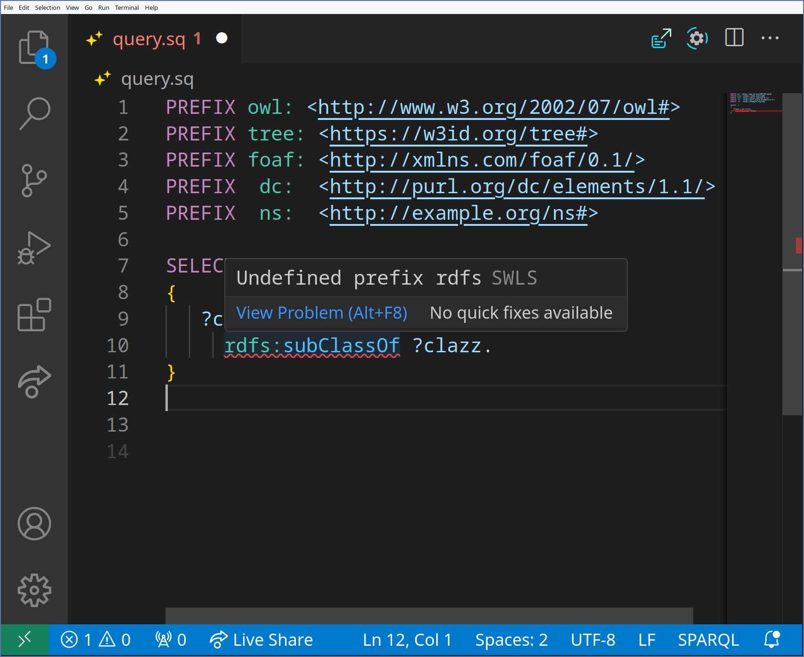
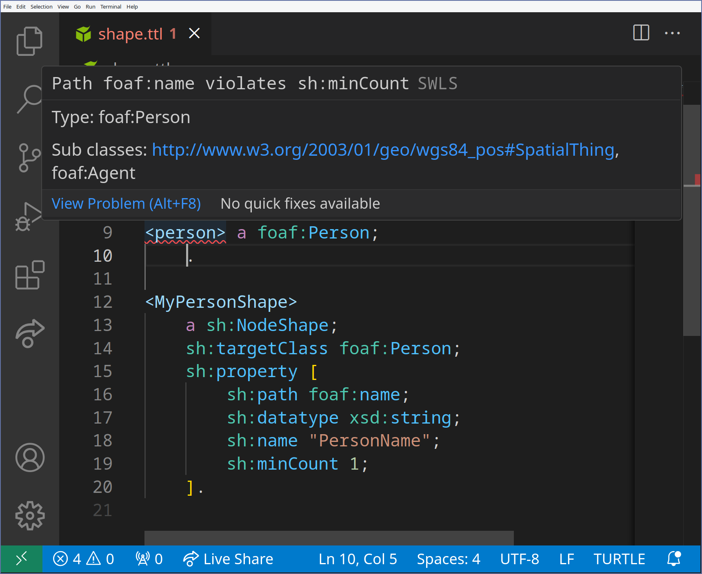
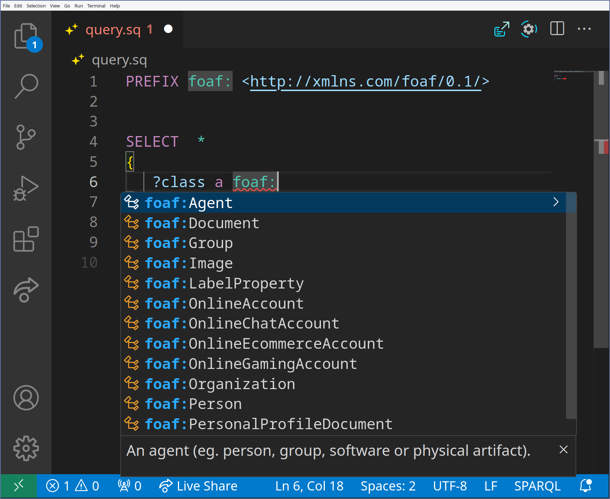
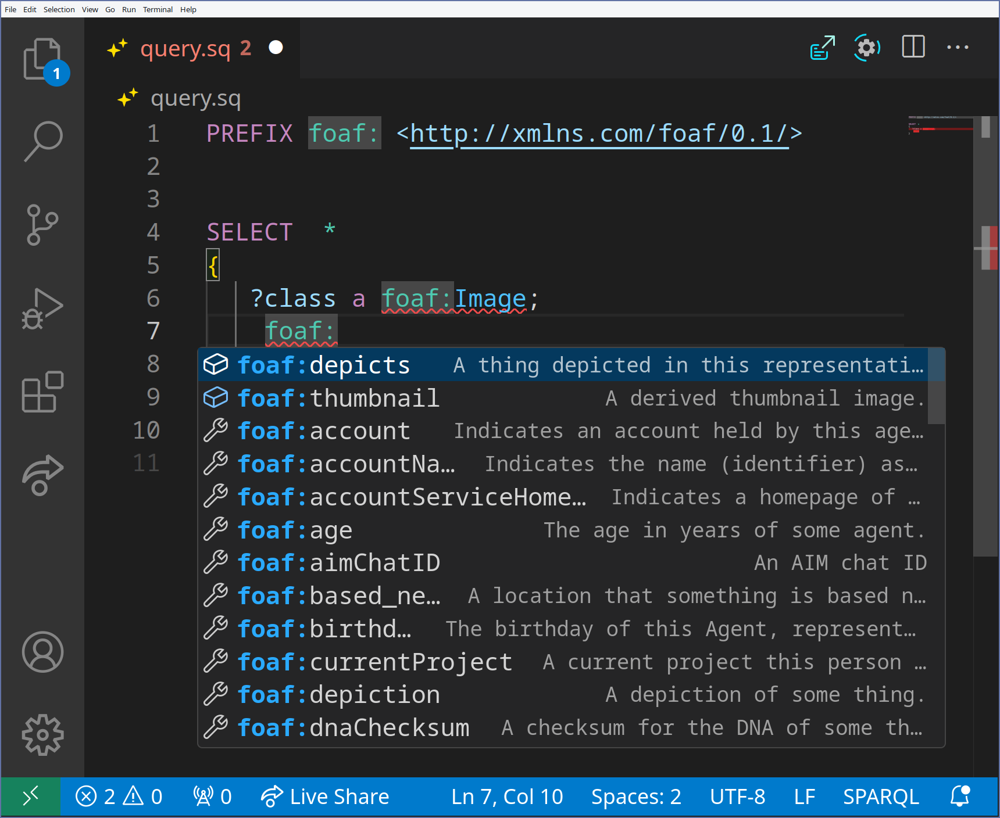

# Semantic Web Language Server

This repo includes the source code for the semantic web language server.
The language server provides IDE like functionality for semantic web languages, including Turtle, TriG, JSON-LD and SPARQL.

<!-- A live demo can be found [online](https://ajuvercr.github.io/semantic-web-lsp/), built with monaco editors. -->

## Documentation

- [lsp-core](https://semanticweblanguageserver.github.io/swls/docs/lsp_core/index.html)
- [lang-turtle](https://semanticweblanguageserver.github.io/swls/docs/lang_turtle/index.html)
- [lang-jsonld](https://semanticweblanguageserver.github.io/swls/docs/lang_jsonld/index.html)
- [lang-sparql](https://semanticweblanguageserver.github.io/swls/docs/lang_sparql/index.html)
- [swls](https://semanticweblanguageserver.github.io/swls/docs/swls/index.html)

## Features

### Diagnostics

- Syntax diagnostics
- Undefined prefix diagnostics
- SHACL shape diagnostics

### Completion

- Prefix completion (just start writing the prefix, `foa` completes to `foaf:` and adding the prefix statement)
- Property completion (ordered according to domain)
- Class completion (when writing the object where the prediate is `a`)

### Hover

- Shows additional information about the entities like class

### Rename

- Rename terms local to the current file 

### Formatting

- Format Turtle and JSON-LD

### Highlighting

- Enables semantic highlighting

## Use the LSP

Currently a fluent install is possible for NeoVim and VSCode.
However the language server protocol enables swift integration into other editors.

### VS Code

Install the semantic web lsp extension ([vscode](https://marketplace.visualstudio.com/items?itemName=ajuvercr.semantic-web-lsp) or [open-vscode](https://open-vsx.org/extension/ajuvercr/semantic-web-lsp)).

On startup, the extension tries to launch a native `swls` binary (first from its own managed location, then from your `PATH`). If no binary is found it falls back to a bundled WASM worker so the LSP is available immediately.

In the background it checks GitHub releases for a newer version. If one is available you will be prompted to install or update; after the download completes a window reload switches to the native binary. You can control this behaviour with two settings:

- `swls.checkUpdate` (default: `true`) — check for new releases on startup
- `swls.automaticUpdate` (default: `false`) — install updates without prompting

You can configure the LSP to disable certain languages via `swls.turtle`, `swls.jsonld`, and `swls.sparql` (SPARQL is disabled by default as it is not fully supported yet).

### NeoVim

A NeoVim plugin is available at [SemanticWebLanguageServer/swls.nvim](https://github.com/SemanticWebLanguageServer/swls.nvim).

## Screenshots

|Undefined prefix|Shape violation|
|---|---|
|  |  |

|Complete Class|Complete Property|
|---|---|
|  |  |
